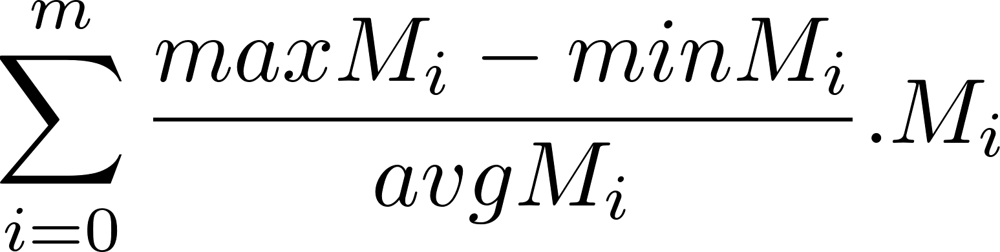

  <h2>Trabajo Práctico 1</h2>
  <h1>Sistemas Paralelos</h1>

# Punto 1

> Resolver la siguiente expresión:

Donde `A`, `B`, `C` y `D` son matrices de `NxN`.

## Solución

### Secuencial

 Dadas las matrices **A, B, C y D** de tamaño N*N, se busca calcular la ecuacion **AA + AB + CD**. Lo primero es calcular los valores de las matricez **AA, AB, CD** en los indices `i`,`j` siendo estas __AA = A[i,j] * A[i,j] --- AB = A[i,j] * B[i,j] --- CD = C[i,j] * D[i,j]__ utilizando una multiplicacion normal de matrices, y antes de aumentar el indice se suman los valores obtenidos anteriormente y se asignan en la matriz **TOTAL** en la misma posicion `i`,`j`, osea, __TOTAL[i,j] = AA + AB + CD__

### OpenMP

Se engloba el bloque a paralelizar bajo la primitiva _parallel_, se utiliza la primitiva _for_ en los bloques iterativos para que se reparta la cantidad de trabajo entre los hilos y por ultimo la primitiva _private_ asignandole a cada hilo sus propios indices y auxiliares para realizar las cuentas.

## Tiempos

| Tamaño | Tiempo Secuencial | Tiempo 2 Threads | Tiempo 4 Threads |
|--------|-------------------|------------------|------------------|
|   512  |     1,157355      |     0,633085     |     0,327391     |
|  1024  |     9,367766      |     5,134782     |     2,773294     |
|  2048  |     75,865119     |     41,164858    |     21,877353    |

### Speedup

| Tamaño | Sp 2 Threads | Sp 4 Threads |
|--------|-------------------------|-------------------------|
|   512  |       1,828119447       |       3,53508496        |
|  1024  |       1,824374628       |       3,377848147       |
|  2048  |       1,842958355       |       3,467746715       |

### Eficiencia

| Tamaño | Ep 2 Threads | Ep 4 Threads |
|--------|-------------------------|-------------------------|
|   512  |       0,914059735       |       0,88377124        |
|  1024  |       0,912187314       |       0,844462037       |
|  2048  |       0,921479178       |       0,866936679       |

## Conclusiones

# Punto 2

> Resolver la siguiente expresión:

Donde Mi son matrices cuadradas de `NxN`. minMi y maxMi son el mínimo y el máximo valor de los elementos de la matriz Mi, respectivamente.
avgMi es el valor promedio de los elementos de la matriz Mi.

## Solución

## Tiempos

| Tamaño | Tiempo Secuencial | Tiempo 2 Threads | Tiempo 4 Threads |
|--------|-------------------|------------------|------------------|
|   512  |     0,374618      |     0,197695     |     0,123818     |
|  1024  |     1,457437      |     0,812408     |     0,550743     |
|  2048  |     5,823712      |     3,204458     |     2,168532     |

### Speedup

| Tamaño | Sp 2 Threads | Sp 4 Threads |
|--------|-------------------------|-------------------------|
|   512  |       1,894929057       |       3,025553635       |
|  1024  |       1,793971798       |       2,64631053        |
|  2048  |       1,817378165       |       2,685555021       |

### Eficiencia

| Tamaño | Ep 2 Threads | Ep 4 Threads |
|--------|-------------------------|-------------------------|
|   512  |       0,947464528       |       0,756388409       |
|  1024  |       0,896985874       |       0,661577633       |
|  2048  |       0,908689083       |       0,671388755       |

## Conclusiones